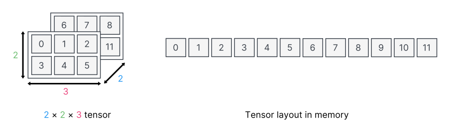

# Tensor fundamentals in Sentis

In Sentis, data is input and output using multi-dimensional arrays called tensors. These tensors function similarly to those in TensorFlow, PyTorch, and other machine learning frameworks.

Tensors can have up to eight dimensions. If a tensor has zero dimensions, it contains a single value called a scalar.

You can create the following types of tensor:

- [`Tensor<float>`](xref:Unity.Sentis.Tensor`1), which stores the data as floats.
- [`Tensor<int>`](xref:Unity.Sentis.Tensor`1), which stores the data as ints.

For more information, refer to [Create and modify tensors](do-basic-tensor-operations.md).

## Memory layout

Sentis stores tensors in memory in row-major order, so the values of the last dimension are stored adjacently.

Here's an example of a 2 × 2 × 3 tensor with the values `0` to `11` and how Sentis stores the tensor in memory.

## Format

A model usually needs an input tensor in a certain format. For example, a model that processes images might need a 3-channel 240 × 240 image in one of the following formats:

- 1 × 240 × 240 × 3, where the order of the dimensions is batch size, height, width, channels (NHWC)
- 1 × 3 × 240 × 240, where the order of the dimensions is batch size, channels, height, width (NCHW)

If your tensor doesn't match the format the model needs, you might get unexpected results.

You can use the Sentis functional API to convert a tensor to a different format. For more information, refer to [Edit a model](edit-a-model.md).

To convert a texture to a tensor in a specific format, refer to [Create input for a model](create-an-input-tensor.md).

## Memory location

Sentis stores tensor data in either graphics processing unit (GPU) memory or central processing unit (CPU) memory, depending on the [backend type](create-an-engine.md#back-end-types) you select. For example, if you use the [`BackendType.GPUCompute`](xref:Unity.Sentis.BackendType.GPUCompute) backend type, tensors are typically stored in GPU memory.

Directly reading from and writing to tensor elements is only possible when the tensor is on the CPU, which can be slow. For better performance, it's more efficient to modify your model using the functional API.

To prevent Sentis from performing a blocking readback and upload, use a compute shader, Burst, or a native array. This allows you to read from and write to the tensor data directly in memory. For more information, refer to [Access tensor data directly](access-tensor-data-directly.md).

When you need to read an output tensor, perform an asynchronous readback. This prevents Sentis from blocking the main code thread while waiting for the model to finish and download the entire tensor. For more information, refer to [Read output from a model asynchronously](read-output-async.md).

## Additional resources

- [Understand the Sentis workflow](understand-sentis-workflow.md)
- [Understand models in Sentis](models-concept.md)
- [Create and modify tensors](do-basic-tensor-operations.md)

